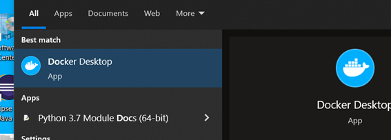

Para realizar la instalación de Docker en una máquina Windows nos iremos a la [url de instación de Docker.](https://docs.docker.com/desktop/windows/install/)

Se hará clic sobre Docker Desktop for Windows, para descargar el instalable:

    

Al hacer clic sobre el instalador descargado nos aparece lo siguiente:

    

Se hace clic en OK para proceder con la instalación:

    

Al finalizar, pedirá un reinicio del PC:

    

Tras reiniciar, aparece una ventana de aceptación de términos. Será necesario marchar el check de aceptación y hacer clic sobre el botón Aceptar.

    

Si tras la instalación nos aparece el siguiente mensaje será necesario instalar el Linux kernel.

    

Para ello, nos iremos a la siguiente [URL](https://docs.microsoft.com/es-es/windows/wsl/install-manual#step-4---download-the-linux-kernel-update-package)

    

Haremos clic en el link de Paquete de actualización de Kernel de Linux WSL 2 para descargar el instalable.
Una vez descargado, ejecutaremos el instalable:

    

Al pulsar sobre siguiente, se completará la instalación:

    

Para confirmar que todo se ha instalado correctamente ejecutaremos Docker Desktop, mediante el icono creado en el escritorio o bien buscando desde la barra de Inicio de Windows.

    

Si al iniciar aparece el siguiente mensaje:

    

Será necesario habilitar Hyper-V. Para ello podéis seguir las indicaciones de este [enlace]
(docs.microsoft.com/es-es/virtualization/hyper-v-on-windows/quick-start/enable-hyper-v#enable-hyper-v-with-cmd-and-dism)
Desde línea de comandos (abierto como admin) podemos ejecutar lo siguiente. Nos pedirá reiniciar después

    

Tras reiniciar nos aparecerá la siguiente ventana:

    

Hacemos clic en Start. Nos aparecerá un tutorial que podemos saltar o seguir.
Finalmente, nos aparecerá lo siguiente, indicando que Docker está corriendo correctamente aunque sin contenedores.

    

Finalmente, para arrancar nuestro ejercicio necesitamos una base de datos postgresql. Para iniciar un contenedor con una postgresql ejecutaremos lo siguiente desde línea de comandos.

docker run -p 5432:5432 --name some-postgres -e POSTGRES_PASSWORD=mysecretpassword -d postgres

Al finalizar, veremos lo siguiente:

    

